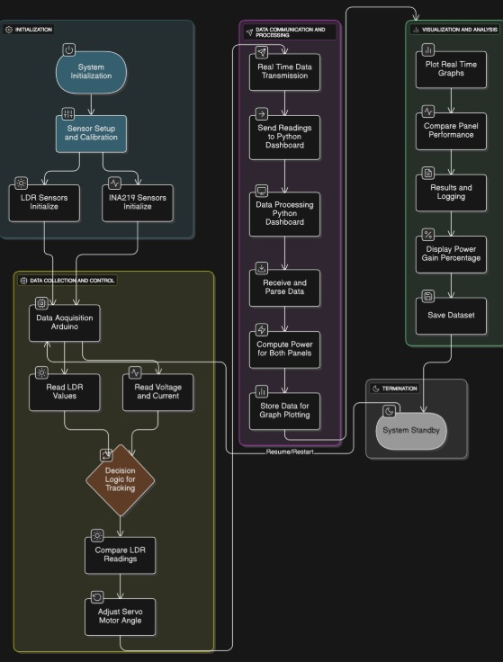
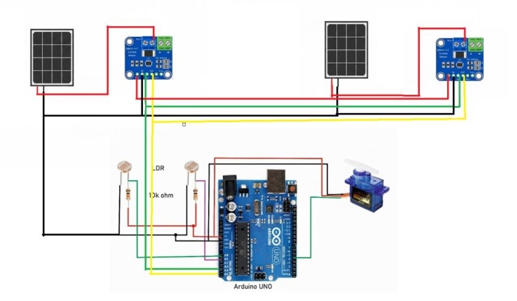
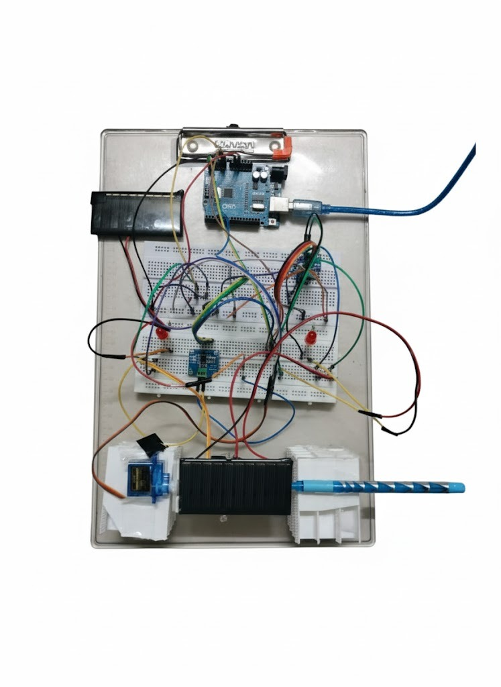
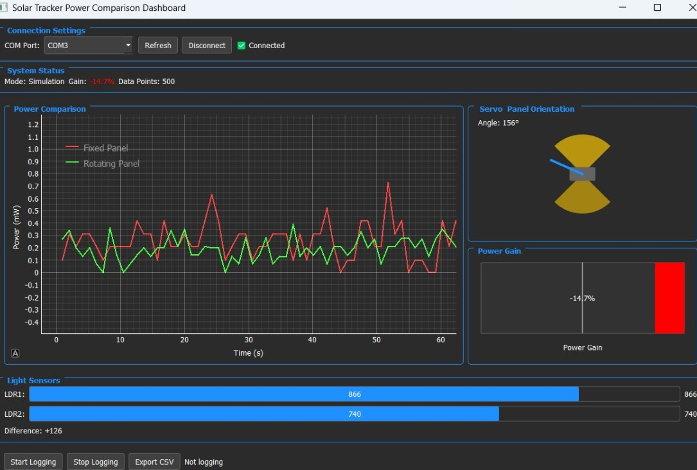

# ☀️ Fixed vs Single axis Rotating Solar Panels — Real-Time Power Comparison

A compact system to compare **fixed vs. rotating solar panels** using **Arduino + Python Dashboard**.

---

## ⚙️ Hardware Overview
| Component | Quantity | Function |
|------------|-----------|-----------|
| Arduino UNO | 1 | Main controller |
| LDR sensors | 2 | Light intensity detection |
| Servo motor | 1 | Panel rotation |
| INA219 sensors | 2 | Voltage, current, and power measurement |
| Solar Panels | 2 | Fixed & rotating comparison |

---

## 📂 Repository Structure

```
SolarTracker-Comparison/
│
├── Arduino/
│ └── SolarTracker_Integrated.ino
│
├── Python/
│ ├── dashboard.py
│ ├── requirements.txt
│
├── images/
│ ├── block_diagram.png
│ ├── circuit_diagram.png
│ └── hardware_setup.png
│
├── docs/
│ └── formulae.md 
│
└── README.md
```

---
<details>
<summary>Arduino Setup</summary>

**📂 Path:** `Arduino/SolarTracker_Integrated.ino`

**Libraries Used:**
- `Servo.h`
- `Wire.h`
- `Adafruit_INA219.h`

**Features:**
- Reads LDRs and applies **offset calibration**  
  $$
  \text{offset} = \text{avg}(LDR1) - \text{avg}(LDR2)
  $$
- Smooths readings with **Exponential Moving Average (EMA)**  
  $$
  S_t = \alpha D_t + (1 - \alpha) S_{t-1}
  $$
- Calculates power:  
  $$
  P = V \times I
  $$
- Sends serial CSV data to Python:

```
LDR1,LDR2,smoothDiff,pos,V_fixed,I_fixed,P_fixed,V_rot,I_rot,P_rot
```
</details>

---

<details>
<summary>Python Dashboard</summary> 

**📂 Path:** `Python/dashboard.py`

**Install Dependencies:**
```bash
pip install -r requirements.txt
```

**Contents of `requirements.txt`:**

```
pyqt5
pyqtgraph
pyserial
pandas
```

**Functions:**

* Reads serial data in real-time.
* Plots **power vs. time** using `PyQtGraph`.
* Computes power gain:
  $$
  \text{Gain(\%)} = \frac{P_{rot} - P_{fixed}}{P_{fixed}} \times 100
  $$
* Supports simulation mode if Arduino not connected.

**Run Dashboard:**

```bash
cd Python
python dashboard.py
```

</details>

## 🧱 System Architecture

###  Block Diagram



### Circuit Diagram



###  Hardware Prototype



###  Python Dashboard


---

## 👥 Contributors

---

## 👥 Main Contributors

| [](https://github.com/Kaarmukilan17) | [](https://github.com/dhruvpatel-vit) | [](https://github.com/souvikkundu23) | [](https://github.com/sankeshsu) |
|

---